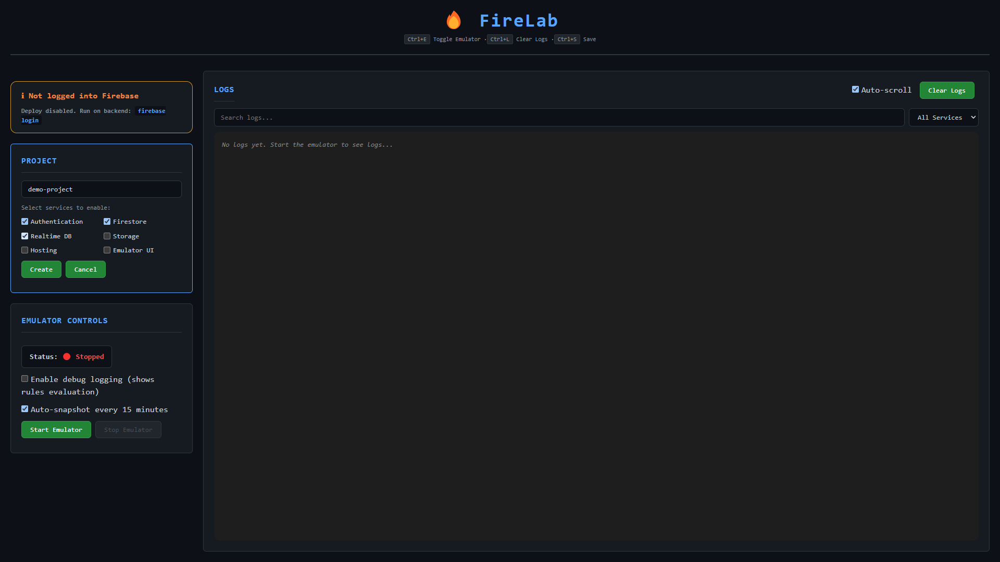

# FireLab

A web-based platform to manage and configure Firebase emulators locally.

## Screenshots

### Dashboard


### Project Setup


### Emulator Running


### Snapshots Manager


### Rules Editor


## Prerequisites

- Node.js (v18+)
- Firebase CLI: `npm install -g firebase-tools`
- Firebase account (optional - only needed for deploying rules to production)

## Setup

### Full Setup (Both Backend & Frontend)

```bash
git clone <your-repo-url>
cd firelab

# Install backend
cd backend
npm install

# Install frontend
cd ../frontend
npm install
```

### Backend Only (For Remote Machine)

```bash
# Clone only backend folder
git clone --no-checkout <your-repo-url>
cd firelab
git sparse-checkout init --cone
git sparse-checkout set backend
git checkout

# Install dependencies
cd backend
npm install
```

### Frontend Only (For Local Machine)

```bash
# Clone only frontend folder
git clone --no-checkout <your-repo-url>
cd firelab
git sparse-checkout init --cone
git sparse-checkout set frontend
git checkout

# Install dependencies
cd frontend
npm install
```

## Running the Application

### Option 1: Local Development (Same Machine)

### Start Backend (Terminal 1)
```bash
cd backend
npm run dev
```
Backend runs on: http://localhost:3001

### Start Frontend (Terminal 2)
```bash
cd frontend
npm run dev
```
Frontend runs on: http://localhost:5173

---

### Option 2: Remote Emulator (Different Machine)

**On Backend Machine (where emulators run):**

1. Find your machine's IP address:
   - Windows: `ipconfig` (look for IPv4)
   - Linux/Mac: `ifconfig` or `ip addr`

2. Start backend:
```bash
cd backend
npm run dev
```

**On Frontend Machine (where you access the UI):**

1. Update `.env` file in `frontend/` folder:
```bash
VITE_API_URL=http://<BACKEND_IP>:3001
```
Example: `VITE_API_URL=http://192.168.1.100:3001`

2. Start frontend:
```bash
cd frontend
npm run dev
```

3. Access dashboard at: http://localhost:5173

4. Emulator UI will be at: `http://<BACKEND_IP>:4000`

**Firewall Note:** Ensure ports 3001, 4000, and emulator ports (9099, 8080, etc.) are open on the backend machine.

## Usage

### Quick Start

1. **Select or Create Project**
   - Choose existing project from dropdown, or
   - Select "+ Create New Project" and enter a name
   - Choose which services to enable (Auth, Firestore, Database, Storage, Hosting, UI)
   - Only selected services will be configured
   - Config loads automatically

2. **Start Emulator**
   - Click "Start Emulator" or press `Ctrl+E`
   - Watch real-time logs
   - View running services with connection status

3. **Manage Snapshots**
   - Auto-snapshots created every 15 minutes (toggle on/off)
   - Auto-snapshot on emulator stop
   - Manual snapshots with custom names
   - Download snapshots as ZIP files
   - Restore or delete snapshots anytime

### Keyboard Shortcuts

- `Ctrl+E` (or `Cmd+E`) - Start/Stop emulator
- `Ctrl+L` (or `Cmd+L`) - Clear logs
- `Ctrl+S` (or `Cmd+S`) - Save config or rules

### Managing Snapshots

**Auto-Snapshots:**
- Automatically created every 15 minutes while emulator runs
- Created on emulator stop
- Keeps last 5 auto-snapshots (older ones deleted)
- Toggle on/off in Emulator Controls

**Create Snapshot:****
- Emulator must be running
- Click "📸 Create Snapshot"
- Optionally name it (e.g., "before-migration", "test-data")
- Auto-generated format: `snapshot-2024-01-15T14-30-00`

**Restore Snapshot:**
- Stop emulator if running
- Click "↻ Restore" on any snapshot
- Emulator starts with that snapshot's data

**Download Snapshot:**
- Click ⬇️ button on any snapshot
- Downloads as ZIP file
- Share with team or backup

**Delete Snapshot:****
- Click 🗑️ button on any snapshot
- Confirm deletion (cannot be undone)

### Importing Existing Projects

**Local Projects:**
```bash
cp -r /path/to/your-firebase-project firebase-projects/my-project
```
Then select from dropdown in UI.

**Cloud Projects:**
Currently not supported. Requires `firebase login` on backend machine.

### Data Management

**Clear All Data:**
- Stop emulator first
- Click "🗑️ Clear All Data" in Data Management section
- Removes all emulator data (Firestore, Auth, Storage, etc.)
- Cannot be undone

**Seed Data:**
- Click "🌱 Seed Data" while emulator is running
- Write Node.js script to populate test data
- Use Firebase Admin SDK or REST API
- Output shows in logs
- Example template provided

### Project Management

**Delete Project:**
- Located in "Project Actions" section at bottom
- Deletes entire project folder (config, rules, snapshots)
- Requires confirmation
- Cannot be undone

### Editing Security Rules

1. Click rule file button (e.g., "firestore")
2. Edit rules in Monaco Editor (VS Code editor)
3. View rules history (last 20 versions)
4. Test rules with basic simulator
5. Save locally with `Ctrl+S`
6. Deploy to production (requires `firebase login` on backend)

### Log Filtering

- **Search**: Type in search box to filter logs
- **Service Filter**: Select specific service (Auth, Firestore, etc.)
- **Clear**: Press `Ctrl+L` or click "Clear Logs"

### Connection Status

When emulator is running, view:
- Active services with green indicator
- Port numbers for each service
- Copy service URLs with 📋 button

## Default Ports

- Auth: 9099
- Firestore: 8080
- Realtime Database: 9000
- Hosting: 5000
- Storage: 9199
- Emulator UI: 4000

## Project Structure

```
firelab/
├── backend/                    # Express API + Firebase CLI wrapper
│   ├── server.js              # Main server with Socket.io
│   └── package.json
├── frontend/                   # React + Vite UI
│   └── src/
│       ├── App.jsx            # Main dashboard component
│       ├── components/        # React components
│       │   ├── ProjectSetup.jsx
│       │   ├── ProjectActions.jsx
│       │   ├── EmulatorControls.jsx
│       │   ├── ConfigEditor.jsx
│       │   ├── RulesEditor.jsx
│       │   ├── LogsViewer.jsx
│       │   ├── SnapshotsManager.jsx
│       │   ├── DataManager.jsx
│       │   ├── DangerZone.jsx
│       │   └── ConnectionStatus.jsx
│       └── App.css            # Styles
└── firebase-projects/          # Firebase project configs
    └── [project-name]/
        ├── firebase.json
        ├── firestore.rules (if Firestore enabled)
        ├── storage.rules (if Storage enabled)
        ├── database.rules.json (if Database enabled)
        ├── .rules-history/     # Rules version history
        ├── .seeds/             # Seed scripts
        └── emulator-data/      # Snapshots
            ├── auto-2024-01-15T14-30-00/
            ├── snapshot-2024-01-15T14-30-00/
            └── my-custom-snapshot/
```

## Features

### Core Features
✅ Create and manage Firebase projects
✅ Import existing Firebase projects
✅ Start/Stop emulators via web UI
✅ Real-time log streaming with ANSI colors
✅ Configure emulator ports
✅ Remote backend support (backend on one machine, frontend on another)

### Data Management
✅ Auto-snapshots (every 15 min + on stop)
✅ Named snapshots with timestamps
✅ Download snapshots as ZIP
✅ Create, restore, and delete snapshots
✅ Clear all emulator data
✅ Seed data with custom scripts
✅ Import data on emulator start
✅ Persistent data between sessions

### Rules Management
✅ Monaco Editor (VS Code editor) with syntax highlighting
✅ Rules history/versioning (last 20 versions)
✅ Basic rules tester (simulate ALLOW/DENY)
✅ Edit Firestore, Storage, and Database rules
✅ JSONC support for database rules (comments allowed)
✅ Inline syntax validation
✅ Save rules locally
✅ Deploy rules to production (requires Firebase login)

### Developer Experience
✅ Customizable service selection per project
✅ Port conflict detection with auto-fix
✅ Debug mode toggle (shows rules evaluation)
✅ Keyboard shortcuts (Ctrl+E, Ctrl+L, Ctrl+S)
✅ Log filtering by service and search
✅ Connection status indicators
✅ Auto-scroll logs
✅ Dark GitHub-inspired theme
✅ Responsive design (mobile-friendly)
✅ Project deletion with safety checks

## Firebase Login (Optional)

Firebase login is **only required** for:
- Deploying rules to production
- Importing projects from Firebase cloud (not yet supported)

For local development, no login needed!

**To enable production deployment:**
```bash
# On backend machine
firebase login
```

The UI will show login status and disable deploy button when not logged in.

## Troubleshooting

**Emulator won't start:**
- Check if ports are already in use
- Verify Firebase CLI is installed: `firebase --version`
- Check logs for error messages

**Backend not connected:**
- Verify backend is running on port 3001
- Check `.env` file has correct `VITE_API_URL`
- Ensure firewall allows connections

**Deploy button disabled:**
- Run `firebase login` on backend machine
- Refresh frontend to update login status

**Snapshot restore fails:**
- Stop emulator before restoring
- Verify snapshot exists in `emulator-data/` folder
- Check logs for detailed error messages
