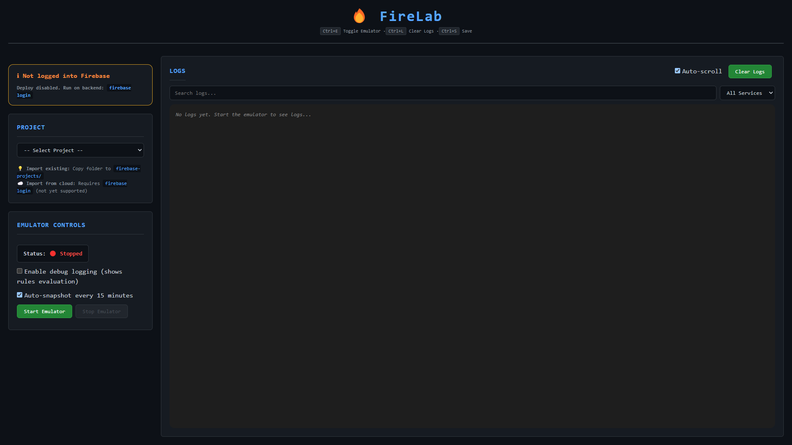
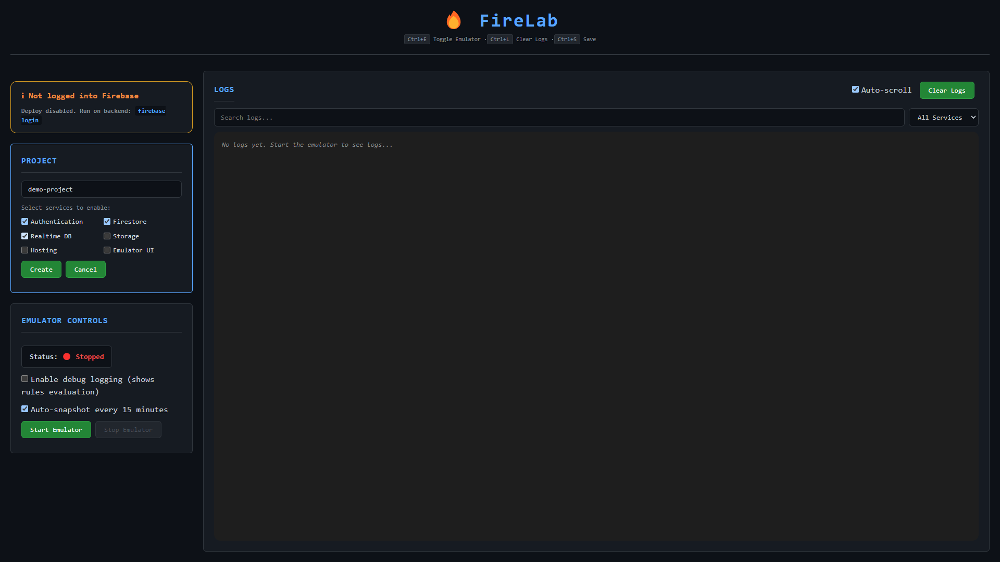
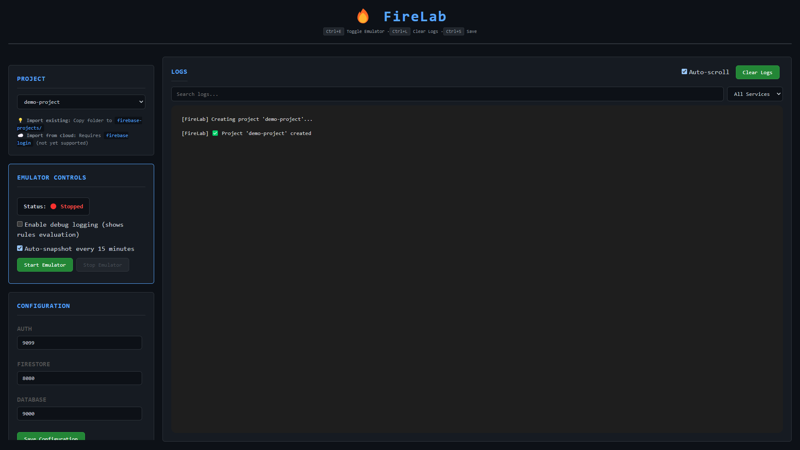
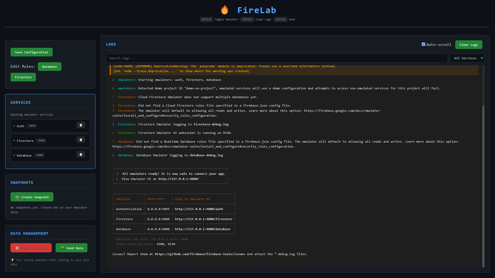
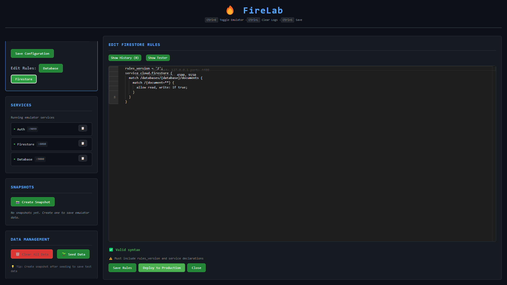

# FireLab

A web-based platform to manage and configure Firebase emulators locally.

## Screenshots

### Dashboard


### Project Setup


### Project Created


### Snapshots Manager


### Rules Editor


### Indexes Editor
Edit, validate, and deploy Firestore composite indexes directly from the UI.

## Prerequisites

- Node.js (v18+)
- Firebase CLI: `npm install -g firebase-tools`
- Firebase account (optional - only needed for deploying rules to production)

## Quick Start with Docker

### Option 1: Docker Hub (Recommended)

```bash
# Pull and run the latest image
docker run -d \
  -p 3001:3001 \
  -p 4000-4010:4000-4010 \
  -p 5000-5010:5000-5010 \
  -p 8080-8089:8080-8089 \
  -p 9000-9010:9000-9010 \
  -p 9099-9109:9099-9109 \
  -p 9199-9209:9199-9209 \
  -v firelab-projects:/app/firebase-projects \
  --name firelab leobardo21/firelab:latest
```

**What this does:**
- Downloads the pre-built FireLab image from Docker Hub
- Creates a persistent volume for your Firebase projects
- Runs both frontend and backend in a single container on port 3001
- Includes a built-in healthcheck (checks `/health` endpoint — no emulator required)

**Access URLs:**
- FireLab UI: http://localhost:3001
- Backend API: http://localhost:3001/api
- Firebase Emulator UI: http://localhost:4000 (when emulator is running)

### Option 2: Docker Compose

```bash
# Clone the repository first
git clone https://github.com/TwoZer00/FireLab.git
cd FireLab

# Run with Docker Compose
docker-compose -f docker-compose.prod.yml up -d
```

**Docker Management:**
```bash
# Stop the container
docker stop firelab

# Start existing container
docker start firelab

# View logs
docker logs firelab

# Remove container (keeps volume)
docker rm firelab

# Update to latest image
docker stop firelab && docker rm firelab
docker pull leobardo21/firelab:latest
# then run again with docker run ...
```

**Interactive mode (foreground with CLI access):**

Use `-it` instead of `-d` to keep an interactive terminal open. This enables the built-in CLI (e.g. `token` command):

```bash
docker run -it \
  -p 3001:3001 \
  -p 4000-4010:4000-4010 \
  -p 5000-5010:5000-5010 \
  -p 8080-8089:8080-8089 \
  -p 9000-9010:9000-9010 \
  -p 9099-9109:9099-9109 \
  -p 9199-9209:9199-9209 \
  -v firelab-projects:/app/firebase-projects \
  --name firelab leobardo21/firelab:latest
```

> Use `-d` (background) for servers/production. Use `-it` (foreground) for local development when you need CLI access.

**Accessing the container shell:**
```bash
docker exec -it firelab bash
```

**Generating a token in background mode:**
```bash
docker exec -it firelab node /app/generate-token.js
```

## Setup

### Full Setup (Both Backend & Frontend)

```bash
git clone <your-repo-url>
cd firelab

# Install all dependencies (backend + frontend)
npm run setup
```

### Backend Only (For Remote Machine)

```bash
# Clone only backend folder
git clone --no-checkout <your-repo-url>
cd firelab
git sparse-checkout init --cone
git sparse-checkout set backend
git checkout

# Install dependencies
cd backend
npm install
```

### Frontend Only (For Local Machine)

```bash
# Clone only frontend folder
git clone --no-checkout <your-repo-url>
cd firelab
git sparse-checkout init --cone
git sparse-checkout set frontend
git checkout

# Install dependencies
cd frontend
npm install
```

## Running the Application

### Option 1: Unified Mode (Recommended)

Build the frontend and serve everything from the backend on a single port:

```bash
npm run build    # Build frontend
npm start        # Start server (serves API + frontend)
```
Access at: http://localhost:3001

### Option 2: Development Mode (Separate Processes)

#### Start Backend (Terminal 1)
```bash
cd backend
npm run dev
```
Backend API runs on: http://localhost:3001

#### Start Frontend (Terminal 2)
```bash
cd frontend
npm run dev
```
Frontend dev server runs on: http://localhost:5173

The frontend port is configurable via `VITE_PORT` in `frontend/.env`.

---

### Option 3: Remote Emulator (Different Machine)

**On Backend Machine (where emulators run):**

1. Find your machine's IP address:
   - Windows: `ipconfig` (look for IPv4)
   - Linux/Mac: `ifconfig` or `ip addr`

2. Start backend:
```bash
npm start
```

**On Frontend Machine (where you access the UI):**

1. Update `.env` file in `frontend/` folder:
```bash
VITE_API_URL=http://<BACKEND_IP>:3001
```
Example: `VITE_API_URL=http://192.168.1.100:3001`

2. Start frontend:
```bash
cd frontend
npm run dev
```

3. Access dashboard at: http://localhost:5173

4. Emulator UI will be at: `http://<BACKEND_IP>:4000`

**Firewall Note:** Ensure ports 3001, 4000, and emulator ports (9099, 8080, etc.) are open on the backend machine.

## Authentication

FireLab uses JWT-based authentication to secure the web interface.

### First Time Setup

1. **Generate Access Token** (choose one method):

   **Method A: Interactive CLI (while server is running)**
   ```
   Type "token" in the server console, then enter a username.
   ```

   **Method B: Script**
   ```bash
   cd backend
   node generate-token.js
   ```

2. **Access the Interface:**
   - Open http://localhost:3001
   - Enter the generated token when prompted
   - Token is saved in browser localStorage

### Token Management

- **View existing tokens:** Check `tokens.json` in the backend directory
- **Generate new token:** Use the `token` CLI command or run `node generate-token.js`
- **Revoke access:** Delete `tokens.json` and restart backend
- **Multiple tokens:** Generate separate tokens for team members
- **Token expiration:** Tokens expire after 365 days but can be revoked earlier
- **Secure storage:** Tokens stored as bcrypt-hashed values; JWT secret auto-persisted to `.jwt-secret`

**Security Note:** Keep your access token secure. Anyone with the token can manage your Firebase emulators.

## Usage

### Quick Start

1. **Select or Create Project**
   - Choose existing project from dropdown, or
   - Select "+ Create New Project" and enter a name
   - Choose which services to enable (Auth, Firestore, Database, Storage, Hosting, UI)
   - Only selected services will be configured
   - Config loads automatically

2. **Start Emulator**
   - Click "Start Emulator" or press `Ctrl+E`
   - Watch real-time logs
   - View running services with connection status

3. **Manage Snapshots**
   - Auto-snapshots created every 15 minutes (toggle on/off)
   - Auto-snapshot on emulator stop
   - Manual snapshots with custom names
   - Download snapshots as ZIP files
   - Restore or delete snapshots anytime

### Keyboard Shortcuts

- `Ctrl+E` (or `Cmd+E`) - Start/Stop emulator
- `Ctrl+L` (or `Cmd+L`) - Clear logs
- `Ctrl+S` (or `Cmd+S`) - Save config or rules

### Managing Snapshots

**Auto-Snapshots:**
- Automatically created every 15 minutes while emulator runs
- Created on emulator stop
- Keeps last 5 auto-snapshots (older ones deleted)
- Toggle on/off in Emulator Controls

**Create Snapshot:**
- Emulator must be running
- Click "📸 Create Snapshot"
- Optionally name it (e.g., "before-migration", "test-data")
- Auto-generated format: `snapshot-2024-01-15T14-30-00`

**Restore Snapshot:**
- Stop emulator if running
- Click "↻ Restore" on any snapshot
- Emulator starts with that snapshot's data

**Download Snapshot:**
- Click ⬇️ button on any snapshot
- Downloads as ZIP file containing all emulator data
- Share with team or create backups
- Includes Firestore, Auth, Storage, and Database data

**Delete Snapshot:**
- Click 🗑️ button on any snapshot
- Confirm deletion (cannot be undone)
- Safety confirmation prevents accidental deletion

### Importing Existing Projects

**Local Projects:**
```bash
cp -r /path/to/your-firebase-project firebase-projects/my-project
```
Then select from dropdown in UI.

**Cloud Projects:**
Currently not supported. Requires `firebase login` on backend machine.

### Data Management

**Clear All Data:**
- Stop emulator first
- Click "🗑️ Clear All Data" in Data Management section
- Removes all emulator data (Firestore, Auth, Storage, etc.)
- Cannot be undone

**Seed Data:**
- Click "🌱 Seed Data" while emulator is running
- Write Node.js script to populate test data
- **Pre-built templates** with Firebase Admin SDK examples
- Use Firebase Admin SDK or REST API
- Output shows in logs with real-time feedback
- **Example templates** for users, posts, and common data structures
- Save custom seed scripts for reuse

> ⚠️ **Security Warning:** The seed endpoint executes arbitrary JavaScript on the backend. Only expose FireLab in trusted environments.

### Project Management

**Delete Project:**
- Located in "Project Actions" section at bottom
- Deletes entire project folder (config, rules, snapshots)
- Requires confirmation
- Cannot be undone

### Editing Security Rules

1. Click rule file button (e.g., "firestore")
2. Edit rules in Monaco Editor (VS Code editor)
3. **Real-time validation** - Syntax errors shown instantly
4. **Rules tester** - Test ALLOW/DENY with simulated requests
5. **Version history** - View and restore from last 20 versions
6. **JSONC support** - Database rules support comments
7. **Fetch from production** - Pull deployed rules from Firebase (requires login)
8. Save locally with `Ctrl+S`
9. Deploy to production (requires `firebase login` on backend)

**Rules Tester:**
- Enter path (e.g., `/users/123`)
- Select operation (read/write)
- Add auth UID (optional)
- Click "Test" to simulate rule evaluation

**Version History:**
- Automatic versioning on each save
- One-click restore to previous versions
- Timestamp tracking for all changes

### Editing Firestore Indexes

1. Click "Indexes" button in the Config Editor
2. Edit composite indexes and field overrides in JSON format
3. **Real-time JSON validation** - Errors shown instantly
4. **Fetch from Firebase** - Pull deployed indexes from production (requires login)
5. Save locally or deploy to production

**Index Format:**
```json
{
  "indexes": [],
  "fieldOverrides": []
}
```

The emulator logs warnings when queries need indexes — use those to define your indexes here.

### Log Filtering

- **Search**: Type in search box to filter logs by content
- **Service Filter**: Select specific service (Auth, Firestore, etc.)
- **Auto-scroll Toggle**: Enable/disable automatic scrolling
- **ANSI Colors**: Full terminal color support
- **Clear**: Press `Ctrl+L` or click "Clear Logs"
- **Copy URLs**: Click 📋 to copy service URLs

### Connection Status

When emulator is running, view:
- Active services with green indicator
- Port numbers for each service
- Copy service URLs with 📋 button

## Default Ports

- Auth: 9099
- Firestore: 8080
- Realtime Database: 9000
- Hosting: 5000
- Storage: 9199
- Emulator UI: 4000

## Project Structure

```
firelab/
├── Dockerfile                  # Unified multi-stage build (frontend + backend)
├── docker-compose.yml          # Dev Docker Compose
├── docker-compose.prod.yml     # Production Docker Compose
├── .releaserc.json             # Semantic Release config
├── package.json                # Root scripts (start, build, setup, release)
├── .github/workflows/          # CI/CD
│   ├── docker-publish.yml     # Docker Hub image publishing
│   └── release.yml            # Semantic versioning & changelog
├── backend/                    # Express API + Firebase CLI wrapper
│   ├── server.js              # Main server with Socket.io + static frontend
│   ├── auth.js                # JWT authentication
│   ├── generate-token.js      # Token generation script
│   └── package.json
├── frontend/                   # React + Vite UI
│   ├── .env.example           # Environment variables template
│   └── src/
│       ├── App.jsx            # Main dashboard component
│       ├── components/        # React components
│       │   ├── ProjectSetup.jsx
│       │   ├── ProjectActions.jsx
│       │   ├── EmulatorControls.jsx
│       │   ├── ConfigEditor.jsx
│       │   ├── RulesEditor.jsx
│       │   ├── IndexesEditor.jsx
│       │   ├── LogsViewer.jsx
│       │   ├── SnapshotsManager.jsx
│       │   ├── DataManager.jsx
│       │   ├── DangerZone.jsx
│       │   ├── TokenAuth.jsx
│       │   └── ConnectionStatus.jsx
│       └── App.css            # Styles
├── scripts/                    # Utility scripts
│   └── screenshots.js         # Automated screenshot generation
├── docs/                       # GitHub Pages landing page & screenshots
└── firebase-projects/          # Firebase project configs
    └── [project-name]/
        ├── firebase.json
        ├── firestore.rules (if Firestore enabled)
        ├── firestore.indexes.json (if Firestore enabled)
        ├── storage.rules (if Storage enabled)
        ├── database.rules.json (if Database enabled)
        ├── .rules-history/     # Rules version history
        ├── .seeds/             # Seed scripts
        └── emulator-data/      # Snapshots
            ├── auto-2024-01-15T14-30-00/
            ├── snapshot-2024-01-15T14-30-00/
            └── my-custom-snapshot/
```

## Features

### Core Features
✅ Create and manage Firebase projects
✅ Import existing Firebase projects
✅ Start/Stop emulators via web UI
✅ Real-time log streaming with ANSI colors
✅ Configure emulator ports
✅ Remote backend support (backend on one machine, frontend on another)

### Data Management
✅ Auto-snapshots (every 15 min + on stop)
✅ Named snapshots with timestamps
✅ Download snapshots as ZIP
✅ Create, restore, and delete snapshots
✅ Clear all emulator data
✅ Seed data with custom scripts
✅ Import data on emulator start
✅ Persistent data between sessions

### Rules Management
✅ Monaco Editor (VS Code editor) with syntax highlighting
✅ Rules history/versioning (last 20 versions)
✅ Basic rules tester (simulate ALLOW/DENY)
✅ Edit Firestore, Storage, and Database rules
✅ JSONC support for database rules (comments allowed)
✅ Inline syntax validation
✅ Fetch deployed rules from Firebase production
✅ Save rules locally
✅ Deploy rules to production (requires Firebase login)

### Indexes Management
✅ Firestore composite indexes editor with JSON validation
✅ Fetch deployed indexes from Firebase production
✅ Deploy indexes to production
✅ Auto-created `firestore.indexes.json` on project init

### Developer Experience
✅ Unified single-container deployment (frontend + backend on one port)
✅ Interactive CLI for token generation
✅ Customizable service selection per project
✅ Port conflict detection with auto-fix
✅ Configurable emulator host binding
✅ Debug mode toggle (shows rules evaluation)
✅ Keyboard shortcuts (Ctrl+E, Ctrl+L, Ctrl+S)
✅ Log filtering by service and search
✅ Log persistence across page reloads (saved to localStorage)
✅ Connection status indicators
✅ Auto-scroll logs
✅ Dark GitHub-inspired theme
✅ Responsive design (mobile-friendly)
✅ Project deletion with safety checks
✅ Configurable CORS origins via `CORS_ORIGINS` env var
✅ Docker healthcheck for container orchestration (healthy as soon as server starts, no emulator needed)
✅ Semantic versioning with automated releases
✅ CI/CD with GitHub Actions (Docker publish + release)

## Firebase Login (Optional)

Firebase login is **only required** for:
- Deploying rules to production
- Importing projects from Firebase cloud (not yet supported)

For local development, no login needed!

**To enable production deployment:**
```bash
# On backend machine
firebase login
```

The UI will show login status and disable deploy button when not logged in.

## Advanced Features

### Port Conflict Detection
- **Automatic detection** of port conflicts before starting
- **Smart suggestions** for alternative ports
- **Auto-fix option** to resolve conflicts instantly
- **Range allocation** for multiple emulator instances

### Debug Mode
- Toggle in Emulator Controls
- Shows detailed rules evaluation
- Displays internal emulator operations
- Helpful for troubleshooting rule issues

### Connection Status
- **Real-time indicators** for all services
- **Backend connection status** with reconnection
- **Service health monitoring** with port information
- **One-click URL copying** for easy sharing

### Emulator Host Binding
- Configure the host binding for all emulator services (default: `0.0.0.0`)
- Change host from the Config Editor UI
- Useful for restricting access to `localhost` or binding to a specific interface

### Safety Features
- **Danger Zone** UI for destructive operations
- **Multiple confirmations** for data deletion
- **Backup prompts** before major changes
- **Undo protection** with clear warnings

## Environment Variables

| Variable | Location | Default | Description |
|----------|----------|---------|-------------|
| `VITE_API_URL` | `frontend/.env` | `http://localhost:3001` | Backend API URL |
| `VITE_PORT` | `frontend/.env` | `5173` | Frontend dev server port |
| `CORS_ORIGINS` | Backend env | `http://localhost:5173,http://localhost:3001` | Comma-separated allowed origins |
| `NODE_ENV` | Backend env | - | Set to `production` for prod builds |
| `FIREBASE_TOKEN` | Backend env | - | Firebase CI token (optional) |
| `JWT_SECRET` | Backend env | *(auto-generated)* | Custom JWT signing secret (auto-persisted to file) |

## CI/CD

The project uses GitHub Actions for automated releases and Docker image publishing:

- **Semantic Release** (`release.yml`) - Automatically bumps version, generates changelog, and creates GitHub releases based on [Conventional Commits](https://www.conventionalcommits.org/)
- **Docker Publish** (`docker-publish.yml`) - Builds and pushes Docker images to Docker Hub on new releases

Commit message prefixes:
- `feat:` → minor version bump
- `fix:` → patch version bump
- `feat!:` or `BREAKING CHANGE:` → major version bump

## Troubleshooting

**Emulator won't start:**
- Check if ports are already in use
- Verify Firebase CLI is installed: `firebase --version`
- Check logs for error messages

**Backend not connected:**
- Verify backend is running on port 3001
- Check `.env` file has correct `VITE_API_URL`
- Ensure firewall allows connections
- Check `CORS_ORIGINS` includes your frontend URL

**Deploy button disabled:**
- Run `firebase login` on backend machine
- Refresh frontend to update login status

**Snapshot restore fails:**
- Stop emulator before restoring
- Verify snapshot exists in `emulator-data/` folder
- Check logs for detailed error messages
